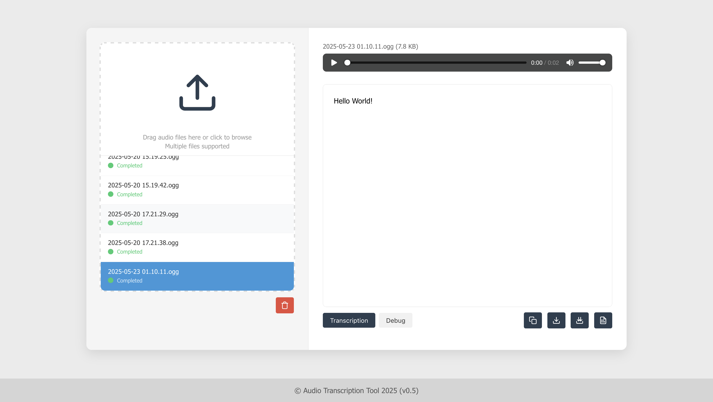

# Whisper API Service

A local, OpenAI-compatible speech recognition API service using the Whisper model. This service provides a straightforward way to transcribe audio files in various formats with high accuracy and is designed to be compatible with the OpenAI Whisper API.



## Features

- 🔊 High-quality speech recognition using Whisper models
- 🌐 OpenAI-compatible API endpoints
- 🚀 Hardware acceleration support (CUDA, MPS)
- ⚡ Flash Attention 2 for faster transcription on compatible GPUs
- 🎛️ Audio preprocessing for better transcription results
- 🔄 Multiple input methods (file upload, URL, base64, local files)
- 📊 Optional timestamp generation for word-level alignment
- 🎧 Convenient built-in client with text editing and audio playback capabilities
- 📱 Responsive web interface included
- 📝 Transcription history logging

## Requirements

- Python 3.12+ recommended
- CUDA-compatible GPU (optional, for faster processing)
- FFmpeg and SoX for audio processing
- Whisper model (download from Hugging Face)

## Installation

### Using server.sh (recommended)

1. Clone the repository:
```bash
git clone https://github.com/kreolsky/whisper-api-server.git
cd whisper-api-server
```

2. Run the server script with the update flag to create and set up the conda environment:
```bash
chmod +x server.sh
./server.sh --update
```

This will:
- Create a conda environment named "whisper-api" with Python 3.12
- Install all required dependencies
- Start the service

### Manual Installation

1. Create and activate a conda environment:
```bash
conda create -n whisper-api python=3.12
conda activate whisper-api
```

2. Install the required dependencies:
```bash
pip install -r requirements.txt
```

3. Start the service:
```bash
python server.py
```

## Configuration

The service is configured through the `config.json` file:

```json
{
    "service_port": 5042,
    "model_path": "/path/to/whisper/model",
    "language": "russian",
    "enable_history": true,
    "chunk_length_s": 28,
    "batch_size": 8,
    "max_new_tokens": 384,
    "temperature": 0.01,
    "return_timestamps": false,
    "audio_rate": 8000,
    "norm_level": "-0.55",
    "compand_params": "0.3,1 -90,-90,-70,-50,-40,-15,0,0 -7 0 0.15"
}
```

### Configuration Parameters

| Parameter | Description |
|-----------|-------------|
| `service_port` | Port on which the service will run |
| `model_path` | Path to the Whisper model directory |
| `language` | Language for transcription (e.g., "russian", "english") |
| `enable_history` | Whether to save transcription history (true/false) |
| `chunk_length_s` | Length of audio chunks for processing (in seconds) |
| `batch_size` | Batch size for processing |
| `max_new_tokens` | Maximum new tokens for the model output |
| `temperature` | Model temperature parameter (lower = more deterministic) |
| `return_timestamps` | Whether to return timestamps in the transcription |
| `audio_rate` | Audio sampling rate in Hz |
| `norm_level` | Normalization level for audio preprocessing |
| `compand_params` | Parameters for audio compression/expansion |

## Web Interface

The service includes a user-friendly web interface accessible at:
```
http://localhost:5042/
```

The interface allows you to:
- Upload audio files via drag-and-drop or file picker
- Listen to the uploaded audio
- View transcription results in real-time
- Edit the transcription text if needed
- Download results as TXT or JSON
- View API request/response details for debugging

## API Usage

### Health Check

```bash
curl http://localhost:5042/health
```

### Get Configuration

```bash
curl http://localhost:5042/config
```

### Get Available Models

```bash
curl http://localhost:5042/v1/models
```

### Transcribe an Audio File (OpenAI-compatible)

```bash
curl -X POST http://localhost:5042/v1/audio/transcriptions \
  -F file=@audio.mp3
```

### Transcribe from URL

```bash
curl -X POST http://localhost:5042/v1/audio/transcriptions/url \
  -H "Content-Type: application/json" \
  -d '{"url":"https://example.com/audio.mp3"}'
```

### Transcribe from Base64

```bash
curl -X POST http://localhost:5042/v1/audio/transcriptions/base64 \
  -H "Content-Type: application/json" \
  -d '{"file":"base64_encoded_audio_data"}'
```

### Transcribe a Local File on the Server

```bash
curl -X POST http://localhost:5042/local/transcriptions \
  -H "Content-Type: application/json" \
  -d '{"file_path":"/path/to/audio.mp3"}'
```

### Request with Additional Parameters

```bash
curl -X POST http://localhost:5042/v1/audio/transcriptions \
  -F file=@audio.mp3 \
  -F language=english \
  -F return_timestamps=true \
  -F temperature=0.0
```

## Response Format

### Without Timestamps

```json
{
  "text": "Transcribed text content",
  "processing_time": 2.34,
  "response_size_bytes": 1234,
  "duration_seconds": 10.5,
  "model": "whisper-large-v3"
}
```

### With Timestamps

```json
{
  "segments": [
    {
      "start_time_ms": 0,
      "end_time_ms": 5000,
      "text": "First segment of text"
    },
    {
      "start_time_ms": 5000,
      "end_time_ms": 10000,
      "text": "Second segment of text"
    }
  ],
  "text": "First segment of text Second segment of text",
  "processing_time": 3.45,
  "response_size_bytes": 2345,
  "duration_seconds": 10.5,
  "model": "whisper-large-v3"
}
```

## Project Structure

The project consists of the following components:

- `server.py`: Entry point that initializes and starts the service
- `server.sh`: Bash script for launching the server with optional conda environment update
- `config.json`: Service configuration file
- `app/`: Main application module
  - `__init__.py`: Contains the `WhisperServiceAPI` class for service initialization
  - `utils.py`: Logging configuration
  - `transcriber.py`: Contains the `WhisperTranscriber` class for speech recognition
  - `audio_processor.py`: Contains the `AudioProcessor` class for audio preprocessing
  - `audio_sources.py`: Contains different audio source handlers (upload, URL, base64, local)
  - `transcriber_service.py`: Manages the transcription workflow
  - `history_logger.py`: Handles saving transcription history
  - `routes.py`: Contains the API route definitions
  - `static/`: Web interface files

## Advanced Usage

### Using with Different Models

You can use any Whisper model by changing the `model_path` in the configuration:

1. Download a model from Hugging Face (e.g., `openai/whisper-large-v3`)
2. Update the `model_path` in `config.json`
3. Restart the service

### Hardware Acceleration

The service automatically selects the best available compute device:
- CUDA GPU (index 1 if available, otherwise index 0)
- Apple Silicon MPS (for Mac with M1/M2/M3 chips)
- CPU (fallback)

For best performance on NVIDIA GPUs, Flash Attention 2 is used when available.

### Transcription History

When `enable_history` is set to `true`, transcription results are saved in a `history` folder organized by date. Each transcription is saved as a JSON file with the format:
```
history/
└── YYYY-MM-DD/
    └── timestamp_filename_xxxx.json
```

## Troubleshooting

### Audio Processing Issues

If you encounter audio processing errors:
- Ensure that FFmpeg and SoX are installed on your system
- Check that the audio file is not corrupted
- Try different audio preprocessing parameters in the configuration

### Performance Issues

For slow transcription:
- Use a GPU if available
- Adjust `chunk_length_s` and `batch_size` parameters
- Consider using a smaller Whisper model
- Reduce `audio_rate` if full quality isn't needed
