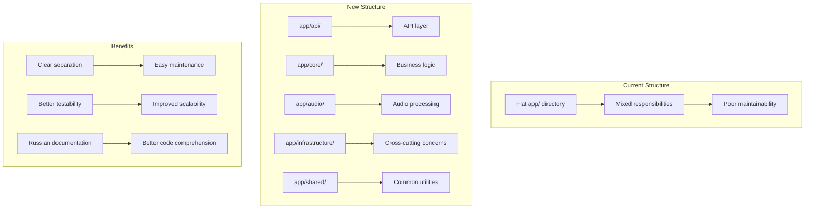

# Implementation Plan: Whisper API Server Code Reorganization and Documentation

## Overview

This document outlines the comprehensive plan to reorganize the Whisper API server codebase from a flat structure to a well-organized, domain-driven architecture. The reorganization will improve code maintainability, readability, and scalability while preserving all existing functionality. Additionally, all code will be documented with Russian docstrings and comments to improve code comprehension.

## Scope Clarification

**Included in this reorganization:**
- Complete restructuring of the `app/` directory into functional domains
- Moving all files to appropriate new locations
- Updating all import statements throughout the codebase
- Adding comprehensive Russian documentation to all modules
- Creating proper docstrings for all classes and functions
- Adding inline comments explaining complex logic

**Excluded from this reorganization:**
- Changing any external APIs or interfaces
- Modifying configuration file structure
- Changing the static web interface
- Altering the server entry point (`server.py`)

## Current State Analysis

### Current Directory Structure
```
app/
├── __init__.py
├── async_tasks.py
├── audio_processor.py
├── audio_sources.py
├── audio_utils.py
├── cache.py
├── context_managers.py
├── file_manager.py
├── history_logger.py
├── logging_config.py
├── request_logger.py
├── routes.py
├── transcriber_service.py
├── transcriber.py
├── utils.py
├── validators.py
└── static/
    └── index.html
```

### Current Issues
1. **Flat structure**: All files in a single directory without logical grouping
2. **Mixed responsibilities**: Infrastructure, business logic, and utilities are mixed
3. **Poor discoverability**: Difficult to locate specific functionality
4. **Maintenance challenges**: No clear boundaries between different concerns
5. **Documentation gaps**: Inconsistent or missing Russian documentation

## Target Architecture

### New Directory Structure
```
app/
├── __init__.py                 # Main application entry point
├── api/                        # API layer
│   ├── __init__.py
│   ├── routes.py              # API route definitions
│   └── middleware.py          # Request/response middleware
├── core/                       # Core business logic
│   ├── __init__.py
│   ├── transcriber.py         # Main transcription service
│   ├── transcription_service.py
│   └── config.py              # Configuration management
├── audio/                      # Audio processing domain
│   ├── __init__.py
│   ├── processor.py           # Audio preprocessing
│   ├── sources.py             # Audio source handlers
│   └── utils.py               # Audio-specific utilities
├── infrastructure/             # Infrastructure services
│   ├── __init__.py
│   ├── logging/               # Logging configuration
│   │   ├── __init__.py
│   │   ├── config.py
│   │   └── request_logger.py
│   ├── storage/               # File and cache management
│   │   ├── __init__.py
│   │   ├── file_manager.py
│   │   └── cache.py
│   ├── async_tasks/           # Background task management
│   │   ├── __init__.py
│   │   └── manager.py
│   └── validation/            # Input validation
│       ├── __init__.py
│       └── validators.py
├── shared/                     # Shared utilities
│   ├── __init__.py
│   ├── context_managers.py    # Reusable context managers
│   ├── decorators.py          # Shared decorators
│   └── history_logger.py      # History logging functionality
└── static/                     # Static web assets
    └── index.html
```

### File Mapping
| Current File | New Location |
|--------------|--------------|
| `routes.py` | `api/routes.py` |
| `request_logger.py` | `infrastructure/logging/request_logger.py` |
| `transcriber.py` | `core/transcriber.py` |
| `transcriber_service.py` | `core/transcription_service.py` |
| `audio_processor.py` | `audio/processor.py` |
| `audio_sources.py` | `audio/sources.py` |
| `audio_utils.py` | `audio/utils.py` |
| `file_manager.py` | `infrastructure/storage/file_manager.py` |
| `cache.py` | `infrastructure/storage/cache.py` |
| `async_tasks.py` | `infrastructure/async_tasks/manager.py` |
| `validators.py` | `infrastructure/validation/validators.py` |
| `logging_config.py` | `infrastructure/logging/config.py` |
| `context_managers.py` | `shared/context_managers.py` |
| `utils.py` | `shared/decorators.py` |
| `history_logger.py` | `shared/history_logger.py` |

## Implementation Plan

### Phase 1: Infrastructure Setup

#### 1.1 Create New Directory Structure
Create all new directories with `__init__.py` files:

```bash
mkdir -p app/api
mkdir -p app/core
mkdir -p app/audio
mkdir -p app/infrastructure/logging
mkdir -p app/infrastructure/storage
mkdir -p app/infrastructure/async_tasks
mkdir -p app/infrastructure/validation
mkdir -p app/shared
```

#### 1.2 Create __init__.py Files
Create empty `__init__.py` files in all new directories to make them Python packages.

### Phase 2: Core Business Logic Migration

#### 2.1 Migrate Transcriber Components
**File**: `app/core/transcriber.py`

```python
"""
Модуль transcriber.py содержит класс WhisperTranscriber, который использует модель Whisper от 
OpenAI для транскрибации аудиофайлов в текст. Класс включает в себя методы для загрузки модели, 
обработки аудио (с использованием класса AudioProcessor), и выполнения транскрибации. 
Обрабатывает выбор устройства (CPU, CUDA, MPS) для выполнения вычислений и обеспечивает 
возможность использования Flash Attention 2 для ускорения работы модели на поддерживаемых GPU.
"""

# [Full implementation with Russian documentation]
```

**File**: `app/core/transcription_service.py`

```python
"""
Модуль transcription_service.py содержит класс TranscriptionService,
который отвечает за обработку и транскрибацию аудиофайлов.
"""

# [Full implementation with Russian documentation]
```

**File**: `app/core/config.py`

```python
"""
Модуль config.py содержит функции для управления конфигурацией приложения.
"""

def load_config(config_path: str) -> Dict:
    """
    Загружает конфигурацию из JSON-файла.
    
    Args:
        config_path: Путь к файлу конфигурации.
        
    Returns:
        Словарь с параметрами конфигурации.
        
    Raises:
        FileNotFoundError: Если файл конфигурации не найден.
        json.JSONDecodeError: Если файл конфигурации содержит некорректный JSON.
    """
    # Implementation moved from __init__.py
```

### Phase 3: Audio Domain Migration

#### 3.1 Migrate Audio Processing Components
**File**: `app/audio/processor.py`

```python
"""
Модуль processor.py содержит класс AudioProcessor, предназначенный для предобработки аудиофайлов 
перед их использованием в системах распознавания речи. Класс предоставляет методы для конвертации 
аудио в формат WAV с частотой дискретизации 16 кГц, нормализации уровня громкости, 
добавления тишины в начало записи, а также для удаления временных файлов, созданных в процессе обработки.
"""

# [Full implementation with Russian documentation]
```

**File**: `app/audio/sources.py`

```python
"""
Модуль sources.py содержит абстрактный класс AudioSource и его конкретные реализации
для обработки различных источников аудиофайлов (загруженные файлы, URL, base64, локальные файлы).
"""

# [Full implementation with Russian documentation]
```

**File**: `app/audio/utils.py`

```python
"""
Модуль utils.py содержит утилитарные функции для работы с аудио.
"""

class AudioUtils:
    """Утилитарный класс для работы с аудио."""
    
    @staticmethod
    def load_audio(file_path: str, sr: int = 16000) -> Tuple[np.ndarray, int]:
        """
        Загрузка аудиофайла с использованием встроенной библиотеки wave.

        Args:
            file_path: Путь к аудиофайлу.
            sr: Целевая частота дискретизации.

        Returns:
            Кортеж (массив numpy, частота дискретизации).
            
        Raises:
            Exception: Если не удалось загрузить аудиофайл.
        """
        # [Implementation with Russian comments]
```

### Phase 4: Infrastructure Migration

#### 4.1 Migrate Logging Components
**File**: `infrastructure/logging/config.py`

```python
"""
Модуль config.py содержит централизованную настройку логирования.
"""

def setup_logging(log_level=logging.INFO, log_file=None):
    """
    Настройка логирования для всего приложения.
    
    Args:
        log_level: Уровень логирования (по умолчанию INFO).
        log_file: Путь к файлу для записи логов (опционально).
    """
    # [Implementation with Russian comments]
```

**File**: `infrastructure/logging/request_logger.py`

```python
"""
Модуль request_logger.py содержит middleware для логирования входящих запросов и ответов.
"""

class RequestLogger:
    """
    Middleware для логирования входящих запросов и ответов.
    """
    
    def __init__(self, app=None, config: Optional[Dict] = None):
        """
        Инициализация middleware.
        
        Args:
            app: Flask приложение.
            config: Конфигурация логирования.
        """
        # [Implementation with Russian comments]
```

#### 4.2 Migrate Storage Components
**File**: `infrastructure/storage/file_manager.py`

```python
"""
Модуль file_manager.py содержит классы для централизованного управления временными файлами.
Предоставляет унифицированный интерфейс для создания, отслеживания и очистки временных файлов.
"""

class TempFileManager:
    """
    Класс для централизованного управления временными файлами.
    
    Предоставляет методы для создания временных файлов и их последующей очистки.
    Использует контекстные менеджеры для автоматической очистки ресурсов.
    """
    
    def __init__(self):
        """
        Инициализация менеджера временных файлов.
        """
        # [Implementation with Russian comments]
```

**File**: `infrastructure/storage/cache.py`

```python
"""
Модуль cache.py содержит функции для кэширования данных.
"""

class SimpleCache:
    """
    Простой кэш на основе словаря с поддержкой TTL (Time To Live).
    
    Attributes:
        cache (Dict): Словарь для хранения кэшированных данных.
        ttl (int): Время жизни кэша в секундах.
    """
    
    def __init__(self, ttl: int = 300):
        """
        Инициализация кэша.
        
        Args:
            ttl: Время жизни кэша в секундах (по умолчанию 5 минут).
        """
        # [Implementation with Russian comments]
```

#### 4.3 Migrate Other Infrastructure Components
**File**: `infrastructure/async_tasks/manager.py`

```python
"""
Модуль manager.py содержит функции для асинхронной обработки задач.
"""

class AsyncTaskManager:
    """
    Менеджер асинхронных задач на основе потоков.
    
    Attributes:
        tasks (Dict): Словарь для хранения информации о задачах.
    """
    
    def __init__(self):
        """
        Инициализация менеджера асинхронных задач.
        """
        # [Implementation with Russian comments]
```

**File**: `infrastructure/validation/validators.py`

```python
"""
Модуль validators.py содержит классы и функции для валидации входных данных.
"""

class FileValidator:
    """
    Класс для валидации файлов.
    
    Проверяет тип файла, размер и другие параметры на основе конфигурации.
    """
    
    def __init__(self, config: Dict):
        """
        Инициализация валидатора файлов.
        
        Args:
            config: Словарь с параметрами конфигурации.
        """
        # [Implementation with Russian comments]
```

### Phase 5: API Layer Migration

#### 5.1 Migrate API Components
**File**: `app/api/routes.py`

```python
"""
Модуль routes.py содержит классы для регистрации маршрутов API
для сервиса распознавания речи.
"""

class Routes:
    """
    Класс для регистрации всех эндпоинтов API.
    
    Attributes:
        app (Flask): Flask-приложение.
        config (Dict): Словарь с конфигурацией.
        transcription_service (TranscriptionService): Сервис транскрибации.
        file_validator (FileValidator): Валидатор файлов.
    """
    
    def __init__(self, app, transcriber, config: Dict, file_validator):
        """
        Инициализация маршрутов.

        Args:
            app: Flask-приложение.
            transcriber: Экземпляр транскрайбера.
            config: Словарь с конфигурацией.
            file_validator: Валидатор файлов.
        """
        # [Implementation with Russian comments]
```

**File**: `app/api/middleware.py`

```python
"""
Модуль middleware.py содержит различные middleware для Flask приложения.
"""

# Request logging middleware will be moved here
```

### Phase 6: Shared Utilities Migration

#### 6.1 Migrate Shared Components
**File**: `app/shared/context_managers.py`

```python
"""
Модуль context_managers.py содержит контекстные менеджеры для управления ресурсами.
"""

@contextlib.contextmanager
def open_file(file_path: str, mode: str = 'rb') -> Generator[BinaryIO, None, None]:
    """
    Контекстный менеджер для безопасного открытия и закрытия файлов.
    
    Args:
        file_path: Путь к файлу.
        mode: Режим открытия файла.
        
    Yields:
        Файловый объект.
    """
    # [Implementation with Russian comments]
```

**File**: `app/shared/decorators.py`

```python
"""
Модуль decorators.py содержит общие декораторы для использования в приложении.
"""

def log_invalid_file_request(func):
    """
    Декоратор для логирования запросов с невалидными файлами.
    
    Args:
        func: Декорируемая функция.
        
    Returns:
        Обернутая функция с логированием ошибок валидации файлов.
    """
    # [Implementation with Russian comments]
```

**File**: `app/shared/history_logger.py`

```python
"""
Модуль history_logger.py содержит класс HistoryLogger для журналирования результатов
транскрибации.
"""

class HistoryLogger:
    """Класс для сохранения истории транскрибации."""
    
    def __init__(self, config: Dict):
        """
        Инициализация логгера истории.
        
        Args:
            config: Словарь с конфигурацией.
        """
        # [Implementation with Russian comments]
```

### Phase 7: Update Main Application

#### 7.1 Update Main Application File
**File**: `app/__init__.py`

```python
"""
Главный модуль приложения, содержащий класс WhisperServiceAPI для инициализации
и запуска сервиса распознавания речи.
"""

# Updated imports from new structure
from .core.transcriber import WhisperTranscriber
from .core.config import load_config
from .api.routes import Routes
from .infrastructure.validation.validators import FileValidator
from .infrastructure.storage.file_manager import temp_file_manager
from .infrastructure.logging.config import setup_logging
from .infrastructure.logging.request_logger import RequestLogger

class WhisperServiceAPI:
    """
    Класс для API сервиса распознавания речи.
    
    Attributes:
        config (Dict): Словарь с параметрами конфигурации.
        port (int): Порт для сервиса.
        transcriber (WhisperTranscriber): Экземпляр транскрайбера.
        app (Flask): Flask-приложение.
        file_validator (FileValidator): Валидатор файлов.
    """
    
    def __init__(self, config_path: str):
        """
        Инициализация API сервиса.

        Args:
            config_path: Путь к конфигурационному файлу.
        """
        # [Implementation with Russian comments]
```

## Implementation Details

### Import Update Strategy

All import statements throughout the codebase will be updated to reflect the new structure. For example:

```python
# Before
from .transcriber import WhisperTranscriber
from .routes import Routes
from .validators import FileValidator

# After
from .core.transcriber import WhisperTranscriber
from .api.routes import Routes
from .infrastructure.validation.validators import FileValidator
```

### Documentation Standards

All code will be documented following these standards:

1. **Module-level docstrings**: Explain the purpose and functionality of the module
2. **Class docstrings**: Describe the class purpose and its attributes
3. **Method/function docstrings**: Explain parameters, return values, and exceptions
4. **Inline comments**: Explain complex logic and business rules
5. **Language**: All documentation in Russian as requested

## Data Flow Diagram



## Error Handling Strategy

### Migration Error Handling
1. **Backup Strategy**: Create a complete backup before starting migration
2. **Incremental Migration**: Move files one module at a time
3. **Validation**: Test each module after migration
4. **Rollback Plan**: Keep the original structure until migration is complete

### Import Error Resolution
1. **Systematic Update**: Update all imports in a systematic way
2. **Validation**: Run tests after each import update
3. **Dependency Tracking**: Track which files depend on others
4. **Circular Dependency Prevention**: Ensure no circular dependencies are created

## Testing Strategy

### Migration Testing
1. **Unit Tests**: Run existing unit tests after each module migration
2. **Integration Tests**: Test API endpoints after reorganization
3. **Import Tests**: Verify all imports work correctly
4. **Functional Tests**: Ensure all functionality remains intact

### Documentation Testing
1. **Docstring Validation**: Ensure all docstrings are properly formatted
2. **Language Validation**: Verify all documentation is in Russian
3. **Completeness Check**: Ensure all classes and functions are documented

## Implementation Steps

1. Create new directory structure with empty `__init__.py` files
2. Migrate infrastructure components (logging, storage, validation)
3. Migrate audio processing components
4. Migrate core business logic
5. Migrate API layer components
6. Migrate shared utilities
7. Update main application file with new imports
8. Add comprehensive Russian documentation to all modules
9. Run tests to verify functionality
10. Remove old files after successful migration

## Performance Considerations

### Migration Performance
1. **Zero Downtime**: Migration should not affect running service
2. **Incremental Updates**: Apply changes incrementally to reduce risk
3. **Backward Compatibility**: Maintain compatibility during transition

### Documentation Performance
1. **Search Optimization**: Well-documented code is easier to search
2. **Maintenance Reduction**: Good documentation reduces maintenance time
3. **Onboarding Speed**: New developers can understand code faster

## Rollback Plan

If issues arise during migration:
1. **Stop Migration**: Halt the migration process
2. **Assess Issues**: Identify what went wrong
3. **Partial Rollback**: Rollback only affected modules
4. **Complete Rollback**: If necessary, restore from backup
5. **Fix Issues**: Address the problems before retrying

## Success Criteria

The migration will be considered successful when:
1. All files are moved to their new locations
2. All imports are updated and working
3. All tests pass without modification
4. All code is documented in Russian
5. The application runs without errors
6. No functionality is lost or changed