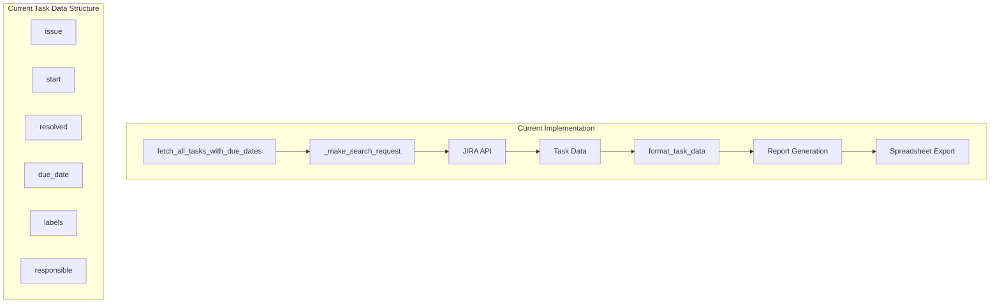
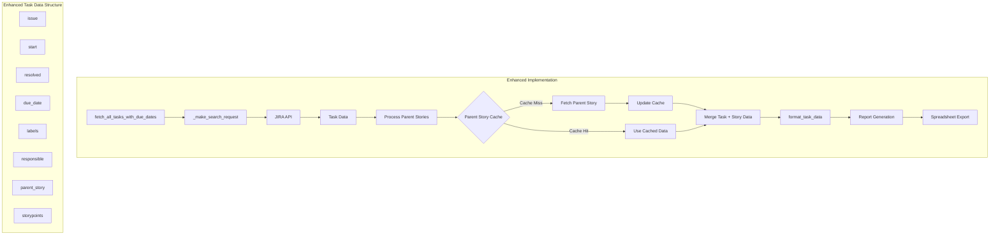
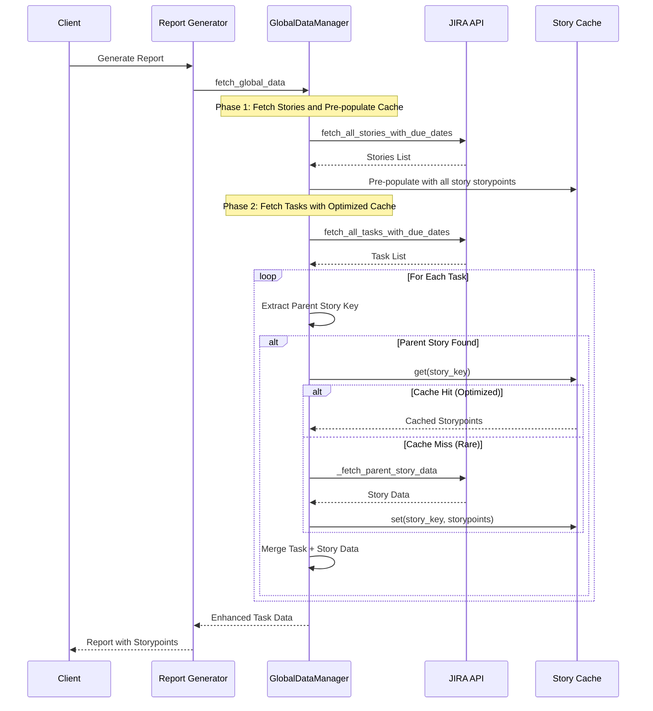

# Integration Plan: Parent Story and Story Points for Global Tasks

## Overview

This document outlines the plan to enhance the `fetch_all_tasks_with_due_dates()` method in `client_jira.py` to include parent story information and story points for each task. This enhancement applies **only** to global tasks that appear in the Tasks report table, not to individual assignee-specific tasks. The enhancement will include a caching mechanism to optimize performance when multiple tasks belong to the same parent story.

## Scope Clarification

**Included in this enhancement:**
- Global tasks fetched via `fetch_all_tasks_with_due_dates()`
- Tasks that appear in the Tasks report table
- Parent story key and storypoints extraction

**Excluded from this enhancement:**
- Individual assignee-specific tasks
- Tasks fetched via other methods
- Other report types

## Current State Analysis

### Current Data Flow


### Current Task Data Structure
The current task data includes:
- issue: Task key
- start: Creation date
- resolved: Resolution date
- due_date: Due date
- labels: Task labels
- responsible: Responsible person

## Target Architecture

### Enhanced Data Flow


### Parent Story Link Structure
Based on the example JSON (`WPCMU-9082.json`), the parent story information is located in:
- Path: `fields.issuelinks`
- Filter: `type.inward = "Parent task"`
- Parent Key: `inwardIssue.key`

## Implementation Plan

### Phase 1: Core Infrastructure

#### 1.1 Create Parent Story Cache Manager
**File**: `src/api/story_cache.py`

```python
class StoryCache:
    """
    Manages caching of parent story data to optimize API calls
    when multiple tasks belong to the same parent story.
    """
    
    def __init__(self):
        self.cache = {}  # {story_key: storypoints}
    
    def get(self, story_key: str) -> Optional[int]:
        """Get storypoints from cache"""
        
    def set(self, story_key: str, storypoints: int) -> None:
        """Set storypoints in cache"""
        
    def clear(self) -> None:
        """Clear the cache"""
```

#### 1.2 Create Parent Story Fetcher
**File**: `src/api/client_jira.py`

```python
def _fetch_parent_story_data(jira_url: str, bearer_token: str, story_key: str) -> Optional[Dict]:
    """
    Fetches parent story data including storypoints
    
    Args:
        jira_url: URL Jira API
        bearer_token: Bearer токен для аутентификации
        story_key: Key of the parent story
        
    Returns:
        Dictionary with story data or None if error
    """
    # Implementation to fetch single story by key
    # Extract storypoints from customfield_10003
    # Return cached data structure
```

### Phase 2: Integration with Task Fetching

#### 2.1 Modify fetch_all_tasks_with_due_dates
**File**: `src/api/client_jira.py`

```python
def fetch_all_tasks_with_due_dates(
    jira_url: str, 
    bearer_token: str, 
    start_date: str, 
    end_date: str, 
    max_results: int = 50,
    story_cache: Optional[StoryCache] = None
) -> Optional[List[Dict]]:
    """
    Enhanced version that includes parent story and storypoints data
    """
    # Initialize cache if not provided
    # Fetch tasks as before
    # For each task:
    #   - Extract parent story key from issuelinks
    #   - Check cache for storypoints
    #   - Fetch from API if not in cache
    #   - Update cache
    #   - Add parent_story and storypoints to task data
```

#### 2.2 Update Task Data Structure
**File**: `src/formatting/reports_data_formatter.py`

```python
def format_task_data(task_issue: Dict, target_tz: Optional[ZoneInfo]) -> Dict:
    """
    Enhanced version that includes parent story and storypoints
    """
    # Extract parent story information
    parent_story = None
    storypoints = None
    
    # Extract from issuelinks where type.inward = "Parent task"
    issuelinks = task_issue.get('fields', {}).get('issuelinks', [])
    for link in issuelinks:
        if link.get('type', {}).get('inward') == 'Parent task':
            parent_story = link.get('inwardIssue', {}).get('key')
            break
    
    # Get storypoints from the enhanced task data
    storypoints = task_issue.get('parent_storypoints')
    
    return {
        "issue": issue_key,
        "start": formatted_created_date,
        "resolved": formatted_resolution_date,
        "due_date": formatted_due_date,
        "labels": labels_str,
        "responsible": formatted_responsible,
        "parent_story": parent_story,
        "storypoints": storypoints
    }
```

### Phase 3: Report Integration

#### 3.1 Update GlobalDataManager with Cache Pre-population
**File**: `src/reports/report_generator.py`

```python
class GlobalDataManager:
    def __init__(self, jira_url: str, bearer_token: str):
        self.jira_url = jira_url
        self.bearer_token = bearer_token
        self.cached_bugs = None
        self.cached_stories = None
        self.cached_tasks = None
        self.story_cache = StoryCache()  # New cache manager
    
    def _populate_story_cache(self, stories: List[Dict]) -> None:
        """
        Pre-populates the story cache with all stories and their storypoints
        to optimize task processing later.
        
        Args:
            stories: List of story dictionaries from JIRA API
        """
        for story in stories:
            story_key = story.get('key')
            storypoints = story.get('fields', {}).get('customfield_10003')
            if story_key and storypoints is not None:
                self.story_cache.set(story_key, storypoints)
    
    def fetch_global_data(self, start_date: str, end_date: str, max_results: int = 50) -> Dict:
        results = {}
        
        # Get stories first and populate cache
        self.cached_stories = fetch_all_stories_with_due_dates(
            self.jira_url, self.bearer_token, start_date, end_date, max_results
        )
        results['stories'] = self.cached_stories or []
        
        # Pre-populate cache with story data for optimization
        if self.cached_stories:
            self._populate_story_cache(self.cached_stories)
        
        # Get bugs
        self.cached_bugs = fetch_all_bugs(
            self.jira_url, self.bearer_token, start_date, end_date, max_results
        )
        results['bugs'] = self.cached_bugs or []
        
        # Get tasks with pre-populated cache
        self.cached_tasks = fetch_all_tasks_with_due_dates(
            self.jira_url, self.bearer_token, start_date, end_date, max_results, self.story_cache
        )
        results['tasks'] = self.cached_tasks or []
        
        return results
```

#### 3.2 Update Report Transformation
**File**: `src/reports/transform_report_data.py`

```python
def _transform_task_section(report_data):
    """
    Enhanced version that includes storypoints
    """
    transformed_data = []
    for task in report_data:
        transformed_data.append([
            task['issue'],
            task['start'],
            task['resolved'],
            task['due_date'],
            task['labels'],
            task['responsible'],
            task['parent_story'],  # New field
            task['storypoints']    # New field
        ])
    return transformed_data
```

#### 3.3 Update Spreadsheet Formatter
**File**: `src/formatting/spreadsheet_formatter.py`

```python
def format_task_sheet(reports_data):
    """
    Formats data for 'Tasks' sheet as a single long vertical list.
    Returns: List of lists for sheet data
    """
    headers = ["Task", "Start", "Resolved", "Due Date", "Labels", "Responsible", "Parent Story", "Story Points"]
    return _format_single_list_sheet_global_data(reports_data['global_tasks'], headers)
```

## Implementation Details

### Parent Story Extraction Logic

```python
def _extract_parent_story_key(task_data: Dict) -> Optional[str]:
    """
    Extracts parent story key from task issuelinks
    
    Args:
        task_data: Task data from JIRA API
        
    Returns:
        Parent story key or None if not found
    """
    issuelinks = task_data.get('fields', {}).get('issuelinks', [])
    
    for link in issuelinks:
        link_type = link.get('type', {})
        if link_type.get('inward') == 'Parent task':
            inward_issue = link.get('inwardIssue')
            if inward_issue:
                return inward_issue.get('key')
    
    return None
```

### Caching Strategy

Simple in-memory cache without expiration for maximum performance:

```python
def _get_or_fetch_storypoints(
    story_key: str,
    jira_url: str,
    bearer_token: str,
    story_cache: StoryCache
) -> Optional[int]:
    """
    Gets storypoints from cache or fetches from API
    
    Args:
        story_key: Parent story key
        jira_url: URL Jira API
        bearer_token: Bearer токен для аутентификации
        story_cache: Story cache instance
        
    Returns:
        Storypoints value or None if not found
    """
    # Check cache first
    cached_points = story_cache.get(story_key)
    if cached_points is not None:
        return cached_points
    
    # Fetch from API
    story_data = _fetch_parent_story_data(jira_url, bearer_token, story_key)
    if story_data:
        storypoints = story_data.get('fields', {}).get('customfield_10003')
        story_cache.set(story_key, storypoints)
        return storypoints
    
    return None
```

**Cache Design:**
- Simple dictionary-based storage: `{story_key: storypoints}`
- No expiration policy (cache lasts for the duration of report generation)
- Automatic clearing when GlobalDataManager is reset
- Minimal memory footprint as only storypoints are stored

## Data Flow Diagram



## Error Handling

### API Error Handling
- Handle cases where parent story is not accessible
- Handle cases where story doesn't exist
- Implement retry logic for failed API calls
- Log errors appropriately

### Cache Error Handling
- Handle cache initialization failures
- Implement cache size limits
- Handle cache corruption scenarios

## Performance Considerations

### Caching Benefits
- Reduces API calls when multiple tasks share the same parent story
- Improves response time for large task sets
- Reduces load on JIRA API
- **Cache pre-population optimization**: Stories are fetched before tasks, so most parent story data is already cached when processing tasks

### Cache Pre-population Strategy
The implementation includes a key optimization: the cache is pre-populated with all stories and their storypoints before processing tasks. This provides significant benefits:

1. **Higher cache hit rate**: Since stories are fetched first, most parent stories referenced by tasks will already be in cache
2. **Reduced API calls**: Minimizes additional API requests during task processing
3. **Faster processing**: Tasks can be processed more efficiently with cached data

### Memory Management
- Simple in-memory cache without expiration
- Cache cleared when GlobalDataManager is reset
- Minimal memory footprint as only storypoints are stored
- Cache is populated once per report generation cycle

## Implementation Steps

1. Create StoryCache class in `src/api/story_cache.py`
2. Create parent story fetcher function in `src/api/client_jira.py`
3. Modify `fetch_all_tasks_with_due_dates` to include parent story data
4. Update `format_task_data` to include parent story and storypoints
5. Update `_transform_task_section` to include new fields
6. Update `format_task_sheet` to include new columns
7. Update GlobalDataManager to use story cache with pre-population

## Testing Strategy

The service runs in Docker Compose and can be tested by sending requests to the running service.

### Test Procedure
1. Start the service with `docker compose up`
2. Send a test request to generate a report:
```bash
curl -X POST "http://localhost:8055/create_report_in_spreadsheet" \
     -H "Content-Type: application/json" \
     -d '{
           "table_id": "1HRhWYzVql1cTv0mfGPd1B0qMXA5yD0xchirlfQJJjEo",
           "secret": "BRgln-IUjja-1kH6B-XONN9"
         }'
```
3. If the report generates successfully without errors, the implementation is working correctly
4. The actual validation of the table data and storypoints will be performed manually